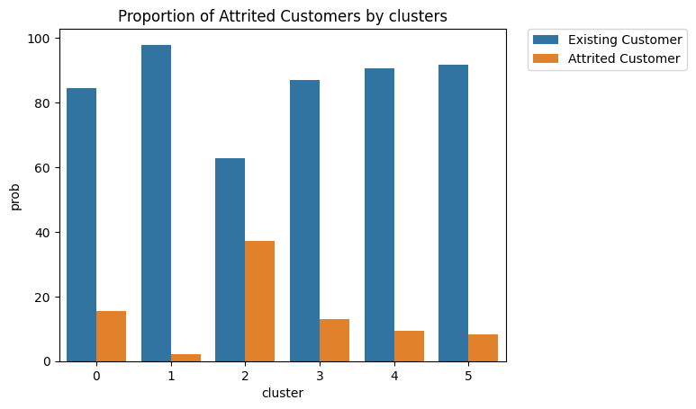

<h2 align="center"> Churn Prediction Project </h2>

<p align="center"><a href="https://github.com/vdbromain/Churn_Prediction">
</a></p>
<h3 align="center">First project in our AI specialization at <a href="https://github.com/becodeorg"><strong>BeCode</strong></a></h3><br><br>


## Description

This repository host our first group project in our chosen specialization.

<div align="justify">
We worked on given data in order to predict whether or not a bank client is
 likely to churn. In order to do so, we analyzed the data to define 
different clusters, we then trained a model to make the prediction and 
finally, we deployed an easy to use app which let our users know if a 
specific client is at risk of churning.
</div>

</div>

The project is divided in 4 folders:

1. .streamlit : contains the config file of streamlit and the images the app uses.`
2. data_storage : contains the DB file and the python file to create the DB
3. datas: contains raw data (BankChurners.csv) and cleaned data (cleaned_data.csv)
4. modeling: use classification and clustering to make the prediction.
5. vizualisations: creation of client profile dashboard with Tableau.

## Installation

1. Clone the repo.

2. If you just wanna deploy the app, install the required libraries using
   
   ```
   pip install requirements_deployment.txt
   ```
   
   If you wanna run the whole code, install all the required libraries using
   
   ```
   pip install requirements.txt
   ```

3. Launch our app using
   
   ```
   streamlit run app.py
   ```

## Usage

<div align="justify">
<i>app.py</i>, which is at the root of our project contains the code of our app.
We used streamlit to improve our design and docker to deploy it easily. Using those libraries, we display a form which get specific client data, run our model using pickle and tell the user if the client is likely to churn or not.
At the bottom of the page, we included a dashboard which displays a series of graphs. (More about it in the vizualisation section.)
</div>

#### data_storage

<div align="justify">
As required, we uploaded the .csv file into a database.
We used SQLAlchemy ORM to create a Database with 2 tables in it. One with the raw data and the other one with the cleaned data.
</div>

<div align="justify">
<h6>With this structure </h6>
<ul>
  <li><strong>Clientnum:</strong> Unique identifier for the customer holding the account</li>
  <li><strong>Attrition Flag:</strong> Internal event (customer activity) variable - if the account is closed then 1 else 0</li>
  <li><strong>Customer Age:</strong> Customer's Age in Years</li>
  <li><strong>Gender:</strong> M=Male, F=Female</li>
  <li><strong>Dependent count:</strong> A financial dependant is anyone who relies on you financially for things like money, clothes, or food This might include children, relatives, spouses, or friends.</li>
  <li><strong>Education Level:</strong> Educational Qualification of the account holder (example: high school, college graduate, etc.)</li>
  <li><strong>Marital Status:</strong> Married, Single, Unknown</li>
  <li><strong>Income Category:</strong> Annual Income Category of the account holder (<40K, 40K-60K, 60K-80K, 80K-120K, >$120K, Unknown)</li>
  <li><strong>Card Category:</strong> Type of Card (Blue, Silver, Gold, Platinum)</li>
  <li><strong>Months_on_book:</strong> Active Time of Relationship with the account</li>
  <li><strong>Total Relationship_Count:</strong> Total number of products held by the customer</li>
  <li><strong>Months Inactive_12_mon:</strong> No. of months inactive in the last 12 months</li>
  <li><strong>Contacts Count_12_mon:</strong> Number of contacts made by the cardholder in the last 12 months.</li>
  <li><strong>Credit_Limit:</strong> Credit Limit on the Credit Card</li>
  <li><strong>Total Revolving Bal:</strong> Total Revolving Balance on the Credit Card</li>
  <li><strong>Avg Open To Buy:</strong> Open to Buy Credit Line (Average of last 12 months)</li>
  <li><strong>Total Amt_Chng_Q4 Q1:</strong> Change in Transaction Amount (Q4 over Q1)</li>
</ul>
</div>

#### modeling

<div align="justify">
In this folder, we worked on 2 models: one for classification and another one for clustering.
<i>classification.py</i> classifies the data between existing customer and attrited customer.
<i>clustering.py</i> defines 6 different profiles of customer and their probability to churn.
</div>



#### vizualisations

We used Tableau to create a dashboard which allows us to understand customer's profiles.
It shows the characteristics parameters of attrited customers and the KPI of the data (in numerical form).


## Results

[work in progress]

## Contact

Data Analyst: [Anil Furkan EMBEL
](https://github.com/anilembel)ML Engineer: [Philippe Meulemans
](https://github.com/Laverdure77)Data Engineers: [Romain Vanden Bossche](https://github.com/vdbromain) & [Anh Sophie Noël](https://github.com/AnhSN)
